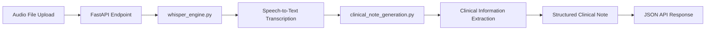
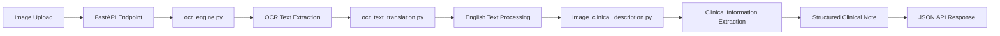
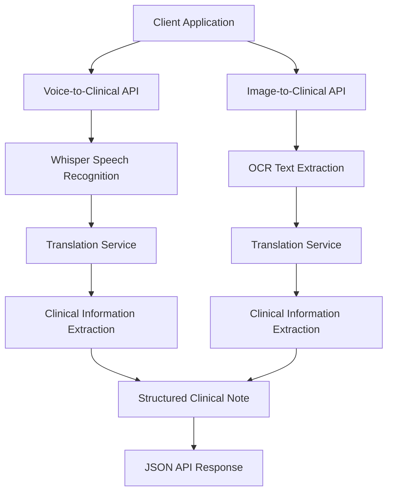

# Multimodal AI Clinical Documentation System

A FastAPI-based Multimodal AI application that converts clinical information from multiple input modalities into structured clinical notes.

The system supports:

- 🎤 Voice-to-Text Processing
- 🖼️ Image-to-Text Extraction (OCR)
- 🌍 Multi-language Translation
- 🏥 Clinical Note Generation
- ⚡ FastAPI REST APIs
- 📄 Structured JSON Responses


# Project Structure

```text
Multimodal_AI/
│
├── app.py
│
├── image_to_text_service/
│   ├── ocr_engine.py
│   ├── ocr_text_translation.py
│   ├── image_clinical_description.py
│
├── voice_to_text_service/
│   ├── whisper_engine.py
│   ├── clinical_note_generation.py
│   ├── voice_response.py
│
├── models/
│   ├── models.py
│
├── utils/
│   ├── logger.py
│   └── config.py
```

# Project Structure Overview

## app.py

Main entry point of the FastAPI application. Defines API endpoints and coordinates requests between image, voice, and clinical processing services. Handles request validation, response generation, and error management.

## image_to_text_service/

Contains all image-processing modules used for extracting and interpreting information from uploaded images. Responsible for OCR, language translation, and generation of structured clinical descriptions. Enables conversion of prescriptions and medical documents into machine-readable clinical data.

### ocr_engine.py

Extracts text from uploaded images using Optical Character Recognition (OCR). Supports printed and handwritten medical content. Produces raw text for downstream processing.

### ocr_text_translation.py

Translates extracted OCR text into English when required. Supports multilingual medical documents and prescriptions. Ensures a consistent language format for further analysis.

### image_clinical_description.py

Converts extracted text into structured clinical information. Identifies diagnoses, medications, and recommendations from image content. Generates a standardized clinical summary.

## voice_to_text_service/

Contains modules for speech transcription and clinical note generation from audio recordings. Processes spoken patient information into structured healthcare documentation. Provides the complete voice-to-clinical-note workflow.

### whisper_engine.py

Performs speech-to-text conversion using the Whisper model. Supports multiple audio formats and languages. Produces accurate transcriptions from uploaded recordings.

### clinical_note_generation.py

Analyzes transcribed speech and extracts clinically relevant information. Identifies symptoms, diagnoses, medications, and recommendations. Generates structured clinical notes from conversational input.

### voice_response.py

Defines response structures for voice-processing APIs. Ensures consistent and validated output formatting. Standardizes API responses across voice-related services.

## models/

Contains shared Pydantic models used throughout the application. Defines request and response schemas for validation and serialization. Improves API consistency and documentation generation.

### models.py

Stores all application-wide data models and response schemas. Provides type validation and structured data handling. Serves as the central location for API contracts.

## utils/

Contains reusable utility modules shared across multiple services. Provides common functionality such as logging and configuration management. Helps maintain a clean and modular codebase.

### logger.py

Implements centralized logging for application monitoring and debugging. Records informational messages, warnings, and errors. Supports troubleshooting and operational visibility.

### config.py

Stores application configurations, constants, and environment-specific settings. Centralizes configurable parameters used across services. Simplifies deployment and maintenance.

# Features

## Voice-to-Text Clinical Documentation

- Upload audio files
- Speech transcription using Whisper
- Clinical entity extraction
- Structured note generation

Supported Audio Formats:

- WAV
- MP3
- M4A
- FLAC

---

## Image-to-Text Clinical Documentation

- Upload medical prescriptions
- Upload handwritten notes
- OCR text extraction
- Translation support
- Clinical note generation

Supported Image Formats:

- JPG
- JPEG
- PNG

---

## Clinical Note Generation

The system automatically extracts:

- Patient Name
- Chief Complaint
- Diagnosis
- Medications
- Recommendations

and converts them into a structured clinical note.

---

# Installation Guide

This project requires Python, FFmpeg, and Tesseract OCR to support multimodal processing, including speech transcription, optical character recognition (OCR), translation, and clinical note generation.

---

## Prerequisites

Before installing the application, ensure the following software is available on your system:

- Python 3.10 or higher
- FFmpeg (for audio processing and Whisper transcription)
- Tesseract OCR (for image text extraction)

---

## Install dependencies

Install all required Python packages using the provided requirements file.

pip install -r requirements.txt

---

## Configure External dependencies


The application depends on FFmpeg and Tesseract OCR. Update the installation paths in utils/config.py according to your local environment.

- FFMPEG_PATH = r"C:\ffmpeg\bin"
- TESSERACT_PATH = r"C:\Program Files\Tesseract-OCR\tesseract.exe"

---

## Launch the Application

Start the FastAPI server using Uvicorn.

uvicorn app:app --reload

Once the server starts successfully, the application will be accessible at:

- Application URL: http://localhost:8000
- Swagger Documentation: http://localhost:8000/docs

---

## Pre-Deployment Checklist

Before deploying the application, verify that:

- All required Python dependencies are installed.
- FFmpeg is installed and correctly configured.
- Tesseract OCR is installed and correctly configured.
- Paths in utils/config.py are updated appropriately.
- All API endpoints are tested and functioning as expected.
- Application logs are being generated successfully.

---

# Sample Requests and Responses

## Image-to-Clinical Note API

### Sample Request

```bash
curl -X POST "http://localhost:8000/clinical_note_from_image" \
-F "file=@prescription.png"
```
You can upload any images with the text, based on the format given below: 

- jpeg
- jpg
- png
---

### Sample Response

```json
{
  "service": "clinical_note_from_image",
  "input_filename": "Screenshot 2026-06-08 104012.png",
  "clinical_note": {
    "patient_name": "Ravi Kumar",
    "diagnosis": "Cervical Spondylosis",
    "medications": [
      "Tablet Paracetamol 656 mg"
    ],
    "recommendations": [
      "Neck Isometric Exercise Cervical Stretching Exercise Hot Fomentation Twice Daily Avoid Prolonged Mobile Usage Maintain Proper Sitting Posture Review After 1 Week"
    ]
  }
}
```

### Description

The API extracts text from the uploaded medical document using OCR, analyzes the clinical content, and generates a structured clinical note containing patient information, diagnosis, medications, and treatment recommendations.

---

## voice-to-Clinical Note API

### Sample Request


```bash
curl -X POST "http://localhost:8000/clinical_note_from_voice" \
-F "file=@patient_audio.m4a"
```


### Sample Response

```json

{ "service": "clinical_note_from_voice", "input_filename": "patient_voice_recording.m4a", "clinical_note": { "chief_complaint": "lower back pain", "duration": "three week", "symptoms": [ "radiating pain to left leg", "pain aggravated by standing" ], "source": "voice" } }
```


This standardized format simplifies integration with electronic health record (EHR) systems, clinical workflows, and downstream healthcare applications.

---

# Architecture & Workflow Diagrams

## 1. Voice-to-Clinical Note Workflow

This workflow converts spoken clinical information into a structured clinical note through automatic speech recognition and clinical information extraction.



### Workflow Description

1. The user uploads an audio file through the API.
2. The Whisper engine transcribes the speech into text.
3. Clinical entities such as complaints, symptoms, and duration are extracted.
4. A structured clinical note is generated.
5. The API returns the clinical note as a JSON response.

---

## 2. Image-to-Clinical Note Workflow

This workflow extracts clinical information from medical documents, prescriptions, or reports using OCR and clinical text processing.



### Workflow Description

1. The user uploads a medical image or prescription.
2. OCR extracts text from the image.
3. Non-English text is translated into English if required.
4. Clinical entities such as diagnosis, medications, and recommendations are identified.
5. A structured clinical note is generated.
6. The API returns the extracted clinical information as a JSON response.

---

## System Architecture Overview

## End-to-End Multimodal Clinical Documentation Workflow




### Architecture Summary

* **FastAPI** serves as the API layer and request handler.
* **Whisper Engine** processes audio inputs and generates transcriptions.
* **OCR Engine** extracts text from uploaded images.
* **Translation Engine** converts multilingual text into English when required.
* **Clinical Processing Modules** generate structured clinical notes from extracted content.
* **JSON Responses** provide standardized outputs for downstream healthcare applications.

```
```


